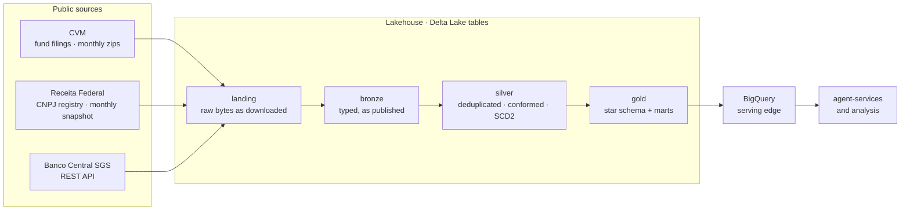

# data-platform — a Python-first lakehouse, orchestrated by Airflow 3

[](https://github.com/VitorFaccin/data-platform/actions/workflows/ci.yml)
[](LICENSE)

A **batch data platform** on Apache Airflow 3.3 that lands Brazilian public data — CVM
investment-fund filings, the Receita Federal CNPJ company registry and Banco Central time
series — into a bronze/silver/gold **lakehouse of Delta Lake tables**, transformed in
**Python (Polars)** and served through BigQuery.

It exists to answer one question: **what does a data platform look like when every
pipeline stays correct when things go wrong?** Re-runs that do not duplicate, backfills
that do not corrupt, upstream format drift that fails loudly instead of landing quietly.
Local-first by design: `docker compose up` runs the platform with no cloud credentials;
the GCP footprint is declared in [`infra/`](infra/) as Terraform and applied on demand.

> **Status: platform foundation.** Runtime, conventions, quality gates and infrastructure
> are in place; domains land one pull request at a time, each held to the decisions
> below. See the [roadmap](#roadmap).

---

## Architecture at a glance



Airflow orchestrates every arrow and computes none of them in the scheduler. DAGs hand
off to each other through **Assets** — a downstream DAG runs when its input table was
actually written, not at a cron offset.

The same code runs in two places, switched by one variable:

| | `DATA_PLATFORM_SINK=local` | `DATA_PLATFORM_SINK=gcp` |
|---|---|---|
| Landing + Delta tables | the `warehouse` Docker volume | GCS buckets |
| Serving | DuckDB over the Delta tables | BigQuery (gold only) |
| Credentials | none | a least-privilege service account ([`infra/iam.tf`](infra/iam.tf)) |

---

## The one rule everything else follows

**A DAG folder owns everything the DAG needs** — and inside that folder, every line of
code has exactly one home:

```
dags/<domain>/<dag_name>/
├── <dag_name>.py   # ORCHESTRATION — the DAG, named after its folder, thin as config
├── adapters.py     # I/O — every side effect: HTTP, Delta reads/writes, BigQuery
├── core/
│   ├── schema.py   # CONTRACTS — table schemas (Polars dtypes), typed params
│   └── domain.py   # PURE LOGIC — parse, validate, transform; no network, no disk
└── README.md       # idempotency key, failure isolation, format traps, consumers
```

Transformations are pure functions in `domain.py` — DataFrame in, DataFrame out. That is
what makes a silver rule testable with a ten-row fixture and nothing else, and it is the
core of the Python-first decision below.

---

## Decisions, and why

| # | Decision | Why |
|---|---|---|
| 1 | **Folder-per-DAG inside `dags/<domain>/`** | Everything that changes together lives together: one pipeline is one folder, one review, one revert. The top level stays canonical (`dags/`, `include/`, `plugins/`, `tests/`); `.airflowignore` keeps the processor away from non-DAG modules. |
| 2 | **`core/` is pure and holds exactly `schema.py` + `domain.py`** | Purity is what makes the rules testable without infrastructure; the two-module cap keeps "where do I change this?" single-answer. Format drift upstream raises `UnexpectedLayoutError` at the boundary — never a permissive cast that surfaces weeks later in a dashboard. |
| 3 | **Python-first transforms, not SQL-first** | Every transformation, bronze to gold, is a pure Polars function with unit tests. The logic this data demands — layout drift across 20 years of files, change detection on republished months, SCD2 diffing — is code-shaped, and one language from ingestion to gold means one test harness. What dbt would have given for free (lineage, data tests, docs) is paid for explicitly: Assets, quality-gate tasks, per-DAG READMEs. Full record in [ARCHITECTURE.md](docs/ARCHITECTURE.md#why-python-first-not-sql-first). |
| 4 | **Delta Lake tables, not loose parquet** | A Delta table is parquet plus a transaction log: a write commits atomically or not at all, `MERGE` exists, old versions stay readable. A job that dies halfway leaves the table at its previous version instead of half-written. `deltalake` (delta-rs) is Rust, so Polars reads and writes it with no JVM and no cluster. |
| 5 | **Idempotency by construction** | Every write is either a partition overwrite scoped by a predicate or a `MERGE` on the business key — never a blind append. Retries, clears and backfills are routine in Airflow; a re-run must produce exactly what one run produces, and the tests prove it by running twice. |
| 6 | **Terraform owns containers, the pipeline owns tables** | Buckets, datasets, IAM and budget are infrastructure ([`infra/`](infra/)). A table's schema is declared in its DAG's `core/schema.py`, enforced by Delta at write time and created by the first write. A table managed by Terraform drifts on the first schema change — and Terraform would "fix" it backwards. |
| 7 | **BigQuery is the serving edge, not the lake** | Bronze and silver live as Delta tables in object storage; only gold is published to BigQuery, where analysts and the agent layer query it. Storage stays cheap and engine-neutral; the warehouse holds what people actually read. |
| 8 | **Polars on one node; Spark only when measured** | These datasets fit one machine, where Polars is faster and operationally simpler. Spark earns a place only where a benchmark shows single-node processing breaking — the planned candidate is the 20-year CVM backfill, run on Dataproc Serverless. A Spark cluster in compose would be résumé-driven engineering: "distributed" across one laptop. |
| 9 | **Asset (data-aware) scheduling between DAGs** | A consumer runs when its input landed, not at a cron offset that breaks the day ingestion is 20 minutes late. Caveat stated where it matters: an Asset event signals producer *success*, not data *quality*; quality gates remain tasks. |
| 10 | **Imports at the top (PEP 8); work only inside tasks** | Every import sits at the top of its module, enforced by ruff (`PLC0415`). Measured in the image: `polars` + `deltalake` add ~0.1 s to a parse that `airflow.sdk` alone makes ~0.9 s — readability wins over lazy imports. What stays banned at module level is *work*: I/O, `Variable.get`, computation — the dag-processor would run it on every parse. Details in [ARCHITECTURE.md](docs/ARCHITECTURE.md#module-conventions). |
| 11 | **LocalExecutor compose, not the official Celery stack** | A single-node platform gains nothing from Redis + distributed workers locally. Production would move heavy tasks off the worker (KubernetesPodOperator or Cloud Run Jobs) — the task code does not change, only where it runs. |
| 12 | **Dependencies are baked into the image at build time** | Compose runs `FROM apache/airflow:3.3.1-python3.13` + `pip install -r requirements.txt` ([`Dockerfile`](Dockerfile)) — the shape a production image has. `_PIP_ADDITIONAL_REQUIREMENTS` was rejected: it re-resolves the tree on every container start — slow, and it drifts from the pin. |

### Deliberately not used (with reasons)

- **dbt**: the right tool when a team of SQL analysts owns the models. Here the
  transformations are code-shaped and unit-tested in Python; running dbt next to them
  would split the logic across two languages and two test harnesses. See decision 3.
- **A Spark cluster in docker-compose, or Databricks**: see decision 8. When Spark
  arrives it runs serverless, next to a benchmark that justifies it.
- **Loose parquet as the table format**: no atomic commit, no `MERGE`, no way to tell
  a finished write from a crashed one. See decision 4.
- **dag-factory** (YAML-declared DAGs): the right tool for fleets of homogeneous DAGs;
  here every DAG is distinct, so a YAML layer would only hide the Python it generates.
- **A dataset committed to git**: the full histories are tens of GB; GitHub blocks files
  over 100 MB. That boundary is physics, not preference — it is why the cloud tier and
  the [data contract](docs/DATA_CONTRACT.md) exist.

---

## Roadmap

Two domains and one API, chosen so each forces a different ingestion problem — and so
they cross in gold instead of sitting side by side.

| Domain | Source shape | What it forces |
|---|---|---|
| **`cvm`** — investment funds | Monthly zips, 20+ years of history, past months republished without notice | Incremental ingestion with change detection (ETag/hash), backfill, layout drift across regulations, SCD2 on a registry the source overwrites, a star schema in gold |
| **`cnpj`** — company registry | Full monthly snapshot, multi-GB files | Full-refresh at scale, a conformed company dimension shared with `cvm` (fund managers and administrators are companies) |
| **`bcb`** — Banco Central SGS | REST API | Pagination, retries, rate limits; CDI/Selic series to benchmark fund returns |

## Structure

```
├── dags/
│   └── .airflowignore            # keeps the processor off core/, adapters, READMEs
├── include/                      # shared, business-agnostic helpers (admission rules inside)
├── plugins/
│   └── alerting/                 # GoogleChatNotifier — failure alerts, one thread per run
├── secrets/                      # local credentials, gitignored (service-account key)
├── tests/
│   ├── dags/test_dag_integrity.py     # every DAG parses + house conventions hold
│   └── plugins/                       # the notifier's behaviour, including its failures
├── infra/                        # the GCP footprint as Terraform (validated in CI)
├── docs/                         # ARCHITECTURE.md · DATA_CONTRACT.md
├── Dockerfile                    # apache/airflow:3.3.1-python3.13 + requirements.txt, baked at build
├── docker-compose.yml            # Airflow 3.3.1, LocalExecutor, one command
└── .github/workflows/ci.yml      # lint (<1 min) + integrity suite + image build
```

## Run it locally

```bash
cp .env.example .env        # defaults work as-is for local mode
docker compose up           # first run builds the image; later runs reuse it
```

Changed `requirements.txt`? Rebuild: `docker compose up --build`.

Airflow UI at http://localhost:8080 (no login — SimpleAuthManager, local only). Landing
files and Delta tables live in the `warehouse` Docker volume, mounted at
`/opt/airflow/warehouse` — peek with
`docker compose exec airflow-scheduler python -c "import polars as pl; print(pl.read_delta('/opt/airflow/warehouse/bronze/cvm/fund_daily'))"`. Switching `DATA_PLATFORM_SINK=gcp` in `.env` routes the
same DAGs to GCS + BigQuery: the buckets must exist ([`infra/`](infra/README.md)) and a
service-account key goes in [`secrets/`](secrets/README.md). Failure alerts go to the
Google Chat space in `GOOGLE_CHAT_WEBHOOK_URL`; left empty, they become log warnings.

## Alerting

Every task carries `on_failure_callback=GoogleChatNotifier()` (set once per DAG through
`default_args`), and the integrity gate fails the build if any task lacks it.

- **Fires after the last retry**, never on a retried blip — an alert that cries wolf on
  every transient 503 is an alert people mute.
- **One thread per DAG run**: a backfill that fails twelve mapped months is one thread
  with twelve replies, not twelve messages burying the space.
- **The alert can never break the run**: no webhook configured degrades to a log warning,
  and a failed webhook call is logged and swallowed — an alerting outage must not replace
  the task's real exception.

## Tests

Tests need Airflow installed with its constraints (CI does this). Locally, run them in
the same image the platform uses:

```bash
docker run --rm -v "$PWD:/repo" -w /repo --entrypoint bash apache/airflow:3.3.1-python3.13   -c "pip install -q -r tests/requirements.txt && pytest -p no:cacheprovider"
```

Tiers, each answering a different question:

- **integrity** (`tests/dags/`) — does every DAG *load*? DagBag parses the folder exactly
  as the processor will, then pins the house conventions: every DAG file registers a DAG,
  file named after its folder, README present, every task alerts on failure,
  `catchup=False` everywhere.
- **plugins** (`tests/plugins/`) — do the shared extensions behave, including when their
  own dependencies fail? The notifier is tested with no webhook and with a dead one.
- **contract** (`tests/<domain>/<dag>/`, per DAG) — are parsing and transforms *correct*?
  Pure functions against hand-typed fixtures; raises are asserted as eagerly as successes.
- **idempotency** (per DAG) — does running twice equal running once? The write path runs
  against a temporary Delta table, twice, and the second run must change nothing.

## Quality gates

| Job | Checks |
|---|---|
| **lint** (no Airflow, <1 min) | `ruff` · `yamllint` · `terraform fmt`/`validate` (offline) · no private keys in tracked files · line endings are LF |
| **test** | Airflow 3.3.1 on Python 3.13 (the image's interpreter) installed with the **official constraints file**, DagBag integrity, per-DAG suites |
| **image** | `docker build` of the exact image compose runs — the one failure pip-on-a-host can't reproduce is a requirements pin conflicting with the image's frozen set |

The constraints install deserves the note: without it, pip resolves a slightly different
dependency tree on every run — the suite would go flaky for reasons unrelated to this repo.

Same gates locally: `pip install pre-commit && pre-commit install`.

## Traps worth writing down

- **A Delta overwrite without a predicate replaces the whole table.** `mode="overwrite"`
  is scoped to one partition only when the write says so; forgetting the predicate on a
  monthly re-run silently deletes every other month. Partition-scoped writes are the
  default shape here, and the idempotency tests would catch the difference.
- **Appending is not idempotent.** A retried append doubles the rows and nothing fails.
  That is why decision 5 bans blind appends rather than trusting nobody to retry.
- **An Asset event is not a quality gate.** It fires when the producer task *succeeds* —
  it says nothing about the data. Quality checks are tasks inside the producer, upstream
  of the task that emits the Asset.

## License

[MIT](LICENSE).
